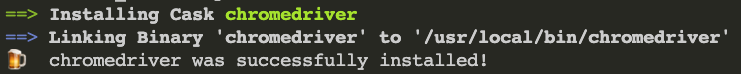

# PChome 24h 自動化搶購

## 功能

* 自動化快速搶購 PChome 24h 指定網頁之商品

## 使用工具

* Python
* Selenium
* Chrome browser

## 使用方法

1. 將 repo 複製到自己的資料夾
    ```bash
    $ git clone https://github.com/jumpingchu/PChome-AutoBuy.git
    $ cd PChome-AutoBuy
    $ pip install -r requirements.txt
    ```
2. 準備 chromedriver
   
   * **MacOS**：
      1. 安裝 chromedriver
        ```bash
        $ brew install chromedriver
        ```
        

      2. `settings.py` 的 `DRIVER_PATH` 填入上面顯示的路徑（如：/usr/local/bin/chromedriver）
   
   * **Windows**：
      1. 在 Chrome 網址列輸入 chrome://settings/help 確認自己的 Chrome 版本（本人是使用 v91.0）
      2. 下載對應 Chrome 版本的 `chromedriver.exe` 並放在同個資料夾內 ([前往下載](https://sites.google.com/chromium.org/driver/))
   
3. 在 `settings.py` 填入資料（請保管好個資）
   
4. 執行程式
    ```bash
    $ python pchome_autobuy.py
    ```

## 注意事項

1. 可以先拿其他的商品連結做測試，以防搶購時的突發狀況或錯誤（但請記得馬上取消訂單！）
   
2. `settings.py` 內的 CHROME_PATH 可讓 chrome 記住登入資訊，可提升搶購速度，建議使用
   
3. 本程式碼 **尚未適用** 於數量多於１或必須選擇顏色或樣式的商品

4. 本程式碼單純是提供搶購足夠數量的商品為主，**禁止用於大量收購並哄抬價格的黃牛行為！**

## 程式執行流程

1. 將商品加入購物車
2. 前往購物車
3. 登入帳戶（若已記住登入資訊要記得拿掉）
4. 點選一次付清 (支援 LINE Pay)
5. 提示訊息點擊「確定」（疫情期間的特別狀況）
6. 填入各項資料
7. 勾選同意
8. 點擊送出訂單

## 貢獻

* 如果你有想要新增的功能，或是你有發現 bug，歡迎隨時發 Issue 或是發 PR 喔！
* 感謝 [sheway](https://github.com/sheway) 提供新的功能與想法
